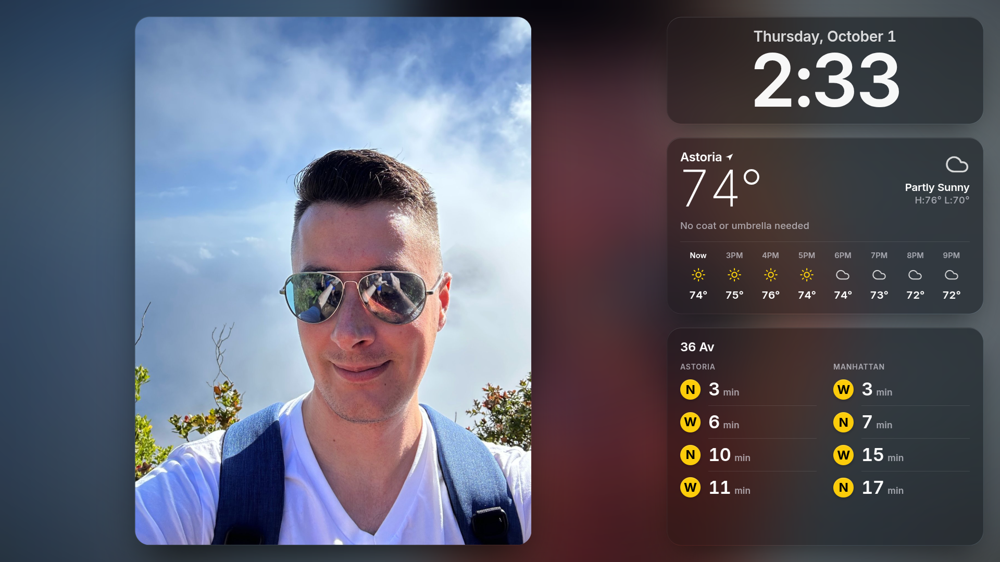

# Astoria Home Dashboard

A configurable, local-only "before you leave the house" dashboard for a 27"
monitor driven by a Raspberry Pi running Chromium in kiosk mode. Shows the next
trains at **any NYC subway station** (any lines), the weather for **any
location**, the time, and a rotating slideshow of personal photos. It ships
defaulted to **36 Av (N/W, Astoria)** and **Astoria 11106**, but everything is
tunable from the in-app **Settings** screen (no restart needed).

No cloud. No auth. Everything (data sources, photo files, the served app) runs
locally on `127.0.0.1`.



> *(Above: captured straight from the Raspberry Pi 3 B+ kiosk at 1920×1080.)*

See [`PLAN.md`](./PLAN.md) for architecture and design rationale.

---

## What's on screen

```
┌──────────────────────────────────┬──────────────────┐
│                                  │     CLOCK        │
│            PHOTOS                ├──────────────────┤
│        (rotates every 60s)       │    WEATHER       │
│                                  ├──────────────────┤
│                                  │     TRAINS       │
└──────────────────────────────────┴──────────────────┘
```

### Look and feel
The UI follows Apple's design language (StandBy / Lock Screen / widgets):

- **Ambient backdrop**: the current photo, heavily blurred, fills the whole
  screen, so the dashboard takes on each photo's colors. It's drawn into a
  tiny canvas and stretched — the browser's smooth upscaling does the blur —
  because a full-screen CSS `filter: blur()` exceeds the Pi 3 GPU's maximum
  render surface and silently renders nothing.
- **Glass panels**: Clock, Weather and Trains are translucent "material"
  cards (`backdrop-filter`) with a faint lit top edge and soft shadow.
- **Typography**: the system font (SF Pro on a Mac); the Pi has no SF, so a
  bundled **Inter Variable** stands in. Large numerals get negative tracking,
  small labels slightly positive.
- **Motion**: restrained — values that change (countdowns, temperature) slide
  gently into place, photos cross-fade. Honors `prefers-reduced-motion`,
  `prefers-reduced-transparency` (solid panels) and `prefers-contrast`.

### Trains panel
Real-time arrivals for **any station and any lines** you pick in Settings.
The two columns are labeled by the station's **real North/South direction
labels** (from the bundled MTA Stations dataset) — e.g. "Astoria" /
"Manhattan" for 36 Av. Each column lists its **next four trains in arrival
order**: the line's colored route bullet plus a large countdown ("Now" in
green when a train is due).

- **Multi-feed aware**: if the selected lines span multiple MTA realtime feed
  groups (e.g. an N/Q/R/W + a 7), the backend fetches the union of feeds and
  merges arrivals into the two direction buckets.
- **Polled every 30 s**; the backend caches each parsed feed for 15 s (per feed
  URL) so bursty clients don't re-hit MTA.
- **Stale badge** (an orange capsule) in the header if the last successful
  fetch is older than ~90 s (3× the poll interval), or if the backend itself
  flags the data as stale (upstream MTA outage on any contributing feed).
- An empty direction list isn't treated as an error (e.g. `W` is weekdays-only
  Astoria-Ditmars ↔ Whitehall St, so it's empty on weekends / late nights).

### Weather panel
Styled like Apple's Weather widget: the place name (the `label` setting, or
"My Location"), a large thin temperature, the condition with an icon, and the
high / low over the next 12 hours.

- **Polled every 60 s.** NWS (`api.weather.gov`) is the primary provider;
  Open-Meteo (`api.open-meteo.com`) is the fallback. Both are key-less.
- **Hourly strip**: the next 8 hours, starting at "Now", each with a small
  `lucide-react` icon. Precipitation chance appears (in cyan) only when it's
  20 % or more.
- **Coat / umbrella guidance** is a single line that only names what you
  need — "Bring an umbrella", "Wear a coat" — or "No coat or umbrella needed".
  Thresholds: the next 12 hours dip below 55 °F (coat) or rise above 40 %
  precipitation probability (umbrella).

### Clock panel
Lock Screen–style: the date above, large time below, in the configured
timezone, updating every second. No AM/PM and no blinking colon — a calmer
clock for an always-on display.

### Photos panel
Random pick from a local directory (`PHOTO_DIR`), rotating every 60 s. Each
photo floats with rounded corners and a shadow, scaled (up or down) to fit
without distortion, and cross-fades into the next. If `PHOTO_DIR` is unset or
missing, a placeholder message appears instead of broken images.

---

## Settings

Move the mouse and a **gear** fades in at the bottom-left (it auto-hides after
a few idle seconds so it stays out of the way on the kiosk). Click it to open
the **Settings** screen — laid out like iOS Settings, with grouped lists and a
toggle for the 24-hour clock — which configures:

- **Time** — timezone (full IANA list) and 12/24-hour clock.
- **Weather** — enter a **US ZIP code** and hit *Look up* to auto-fill the
  coordinates (key-less, via Zippopotam.us), or set latitude / longitude
  directly. Plus an optional display label and the NWS user-agent contact string.
- **Photos** — the absolute path to your local image directory.
- **Subway** — search **any NYC station** by name, pick it, then tap **which
  of its lines** to show.

Settings persist to a gitignored **`settings.json`** at the repo root and apply
**live, without a restart** (the backend re-reads the file per request, cached
by mtime). The seed defaults still come from `.env`; the UI only writes the
user-tunable overrides.

> The settings endpoints are **unauthenticated by design** — the dashboard is a
> local-only kiosk bound to `127.0.0.1`. Don't expose it to a network.

---

## Mac development

```sh
git clone git@github.com:sudo-dliberty/home-dashboard.git
cd home-dashboard
cp .env.example .env
# .env is optional — defaults work out of the box. Point PHOTO_DIR at a folder
# of jpg/png images here, or set it later in the in-app Settings screen.

./scripts/dev-mac.sh
```

This launches the backend on `http://localhost:8000` and the Vite dev server
on `http://localhost:5173` (Vite proxies `/api/*` to the backend). Open
`http://localhost:5173` for hot-reload, or `http://localhost:8000` to test
the single-process production path (you'll need to set `STATIC_DIR` and run
`./scripts/build.sh` first).

> **Note on changes to `tailwind.config.ts`**: those don't hot-reload — you
> need to restart Vite to see them. Editing `.tsx`/`.css` does hot-reload.

### Just the backend

```sh
cd backend
python3 -m venv .venv
.venv/bin/pip install -r requirements-dev.txt
.venv/bin/uvicorn app.main:app --reload --port 8000
.venv/bin/python -m pytest tests/ -v
```

### Mac fullscreen dry-run (kiosk preview)

```sh
./scripts/build.sh                                     # build SPA into backend/app/static
cd backend && STATIC_DIR=$(pwd)/app/static .venv/bin/uvicorn app.main:app --port 8000 &
../scripts/kiosk-launch.sh http://localhost:8000       # opens Chrome in app/fullscreen mode
```

---

## Raspberry Pi deployment

**Smallest target that comfortably runs the kiosk:** Pi 3B+ (1 GB). Pi
Zero 2 W (512 MB) is the theoretical minimum but tight — you'll want to
pre-resize photos for it. Pi 4 (2 GB) is the smoothest. Use the **64-bit
Raspberry Pi OS image** to avoid compiling `protobuf` from source.

```sh
# On the Pi
git clone git@github.com:sudo-dliberty/home-dashboard.git
cd home-dashboard
cp .env.example .env
# Edit .env: set PHOTO_DIR=/home/pi/Pictures/dashboard (or wherever)

./scripts/pi/install.sh
```

`install.sh` is idempotent. It:

1. Prints the active monitor resolution via `xrandr` — confirm it matches the
   layout assumptions (the UI scales to whatever `vh`/`vw` actually are, but
   it's good to know).
2. Installs apt deps: `python3-venv`, `nodejs`, `npm`, `chromium-browser`,
   `unclutter`, `x11-xserver-utils`.
3. Creates the backend venv and installs Python deps.
4. Runs `npm install` + `npm run build` for the frontend; output lands in
   `backend/app/static/`.
5. Installs `home-dashboard.service` (systemd) and enables it on boot.
6. Copies `kiosk.desktop` into `~/.config/autostart/` so Chromium launches
   fullscreen at the dashboard URL when the desktop session starts.

Useful commands:

```sh
sudo systemctl status home-dashboard.service       # backend health
journalctl -u home-dashboard.service -f            # tail backend logs
./scripts/pi/kiosk-start.sh                        # launch kiosk now (without reboot)
```

### Updating

```sh
git pull
./scripts/pi/install.sh        # safe to re-run
sudo systemctl restart home-dashboard.service
```

---

## Configuration

Configuration is **layered** (see [`docs/CONTRACTS.md`](./docs/CONTRACTS.md)):

- **`.env` keys are SEED DEFAULTS.** Override via `.env` **at the repo root**
  (`backend/app/config.py` resolves the file path relative to itself, so the
  location of `uvicorn`'s working directory does not matter).
- **Runtime changes go through the Settings UI → `settings.json`** (gitignored,
  at the repo root). The effective config = defaults deep-merged with those
  overrides, read live per request.

**User-tunable keys** (seed via `.env`, change anytime in the Settings UI):

| Key | Default | Purpose |
|---|---|---|
| `TIMEZONE` | `America/New_York` | IANA timezone for the clock. |
| `CLOCK_24H` | `0` | `1` for a 24-hour clock. |
| `WEATHER_LAT` / `WEATHER_LON` | `40.7568`, `-73.9296` | Coords (default: 11106). |
| `WEATHER_USER_AGENT` | `home-dashboard (local, you@example.com)` | Contact UA required by NWS; a placeholder is fine. |
| `PHOTO_DIR` | `~/Pictures/dashboard` | Local directory of images. |
| `STATION_STOP_ID` | `R06` | MTA parent stop (36 Av). |
| (routes) | `N`, `W` | Lines to show; picked per-station in the UI. |

**Infra-only keys** (`.env` only — not exposed in the UI):

| Key | Default | Purpose |
|---|---|---|
| `HOST` / `PORT` | `127.0.0.1` / `8000` | Bind address for Uvicorn. |
| `STATIC_DIR` | unset | Set to `backend/app/static` in prod to serve the built SPA. |
| `PHOTO_HEIC` | `0` | Set to `1` and `pip install pillow-heif` to also list `.heic`/`.heif`. **See HEIC note below.** |
| `MTA_NQRW_FEED_URL` | (see `.env.example`) | Override if MTA URL changes. |
| `TRAIN_MAX_MINUTES` | `30` | Drop arrivals more than this many minutes away. |
| `TRAIN_FEED_CACHE_SECONDS` | `15` | Backend cache for MTA polls (per feed). |
| `WEATHER_CACHE_SECONDS` | `300` | Backend cache for weather. |

### Photos — supported formats

Always-on: `.jpg`, `.jpeg`, `.png`, `.webp`, `.gif`.

Opt-in (`PHOTO_HEIC=1` + `pip install pillow-heif`): `.heic`, `.heif`.

> **HEIC caveat:** Chromium on Linux (which is what the Pi runs in kiosk
> mode) does NOT decode HEIC, so `` tags will render broken. The
> backend will *serve* HEIC bytes correctly (`content-type: image/heic`,
> 200 OK), but Chromium can't display them.
>
> If your photos are mostly iPhone-format HEIC, run a one-time batch
> conversion to JPEG (originals preserved, parallelized across cores):
>
> ```sh
> cd "$PHOTO_DIR"
> find . -maxdepth 1 -type f \( -iname "*.heic" -o -iname "*.heif" \) -print0 \
>   | xargs -0 -n1 -P8 -I{} sh -c '
>       f="$1"; jpg="${f%.*}.jpg"
>       [ -f "$jpg" ] || sips -s format jpeg "$f" --out "$jpg" >/dev/null
>     ' _ {}
> ```
>
> Then leave `PHOTO_HEIC=0` so the listing only returns the JPEGs.

### Photo path safety
- Hidden files (starting with `.`) are excluded from the listing.
- Path-traversal: requests like `/api/photos/../etc/passwd` return HTTP 400;
  there's both a filename-character guard and a `relative_to(PHOTO_DIR)`
  containment check after resolution.

---

## API

The backend exposes these JSON endpoints under `/api/`. Full schemas live in
[`docs/CONTRACTS.md`](./docs/CONTRACTS.md).

- `GET /api/health` — `{ ok, uptime_s, station_stop_id }`
- `GET /api/settings` — the **effective** layered config (defaults + overrides).
- `PUT /api/settings` — accept a full or partial config object, validate,
  persist to `settings.json`, return the new effective config. Invalid input →
  `422` with a per-field message. **No auth** (127.0.0.1-only by design).
- `GET /api/stations?q=<query>` — case-insensitive station-name (or exact
  `stop_id`) search; returns up to 25 registry records.
- `GET /api/stations/{stop_id}` — a single station record, or `404`.
- `GET /api/geocode?zip=<US ZIP>` — resolve a ZIP to `{ zip, lat, lon, label }`
  (key-less, Zippopotam.us). Used by the settings UI's *Look up* button.
- `GET /api/trains` — generalized arrival board: `north` / `south` directions,
  each `{ label, arrivals[] }`, driven by the selected station + routes and
  merged across the contributing MTA feed(s).
- `GET /api/weather` — current + 12 hourly + `summary` block. NWS primary,
  Open-Meteo fallback.
- `GET /api/photos` — `{ photos: ["a.jpg", ...] }`. Returns
  `{ photos: [], error: "photo_dir_missing" }` if the photo directory is unset
  or doesn't exist — the frontend renders a friendly placeholder.
- `GET /api/photos/{filename}` — streams the file with
  `Cache-Control: public, max-age=3600`.

Only `PUT /api/settings` writes anything (and only to `settings.json`); all
panels are otherwise read-only.

---

## Tests

Backend (58 tests cover health, trains incl. multi-feed + cache + stale + 503,
weather incl. NWS / fallback / cache / stale / 503 + ZIP geocode, photos incl.
traversal, the layered config store, the settings API, and the station registry):

```sh
cd backend && .venv/bin/python -m pytest tests/ -q
```

Frontend builds cleanly with `tsc -b && vite build`:

```sh
cd frontend && npm run build
```

---

## Tech stack

- **Backend**: Python 3.11+ / FastAPI / Uvicorn. `httpx` for upstream calls,
  `gtfs-realtime-bindings` + `protobuf` for the MTA feed, `pydantic-settings`
  for env-driven config. Pinned versions in `backend/requirements.txt`.
- **Frontend**: React 18 + TypeScript + Vite + Tailwind CSS.
  [`lucide-react`](https://lucide.dev/) for weather icons (tree-shaken
  to ~11 KB JS / 3 KB gz for the 12 icons used). Total bundle ≈ 162 KB JS /
  52 KB gz.
- **Production serving**: single Uvicorn process serves both the built SPA
  (from `backend/app/static/`) and the API. No nginx, no CORS, no Node at
  runtime on the Pi.

---

## License & credits

Licensed under the **MIT License** — see [`LICENSE`](./LICENSE). Contributions
welcome; see [`CONTRIBUTING.md`](./CONTRIBUTING.md).

MTA realtime feed is public; NWS forecast is public; weather fallback courtesy
of [Open-Meteo](https://open-meteo.com/); icons by [Lucide](https://lucide.dev/).
